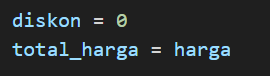

# Laporan Praktikum 2
## Program Pemesanan Tiket Bioskop

### Langkah 1
Pada langkah yang pertama buat kode dua variabel untuk mendefinisikan menyimpan harga tiket Reguler dan VIP dengan harga RP50.000 untuk Reguler dan RP100.000 untuk VIP:

### Langkah 2
Input tipe tiket sesuai yang diinginkan oleh user dan menanyakan kepada user memiliki kartu member atau tidak:

### Langkah 3
Setelah itu, program memvalidasi dan memeriksa tipe tiket yang dimasukkan user. apakah harga tiket sesuai dengan harga reguler atau harga vip. jika tipe tiket tidak valid maka program memberitahu ada kesalahan:

### Langkah 4
Menginisialisasi variabel diskon dengan nilai 0. hitung total harga dari keseluruhan harga yang sudah ditentukan sebelumnya:

### Langkah 5
Program ini menghitung diskon berdasarkan operator ternary, dimana jika user menjawab "Ya/Tidak" diskon 20%/0% diterapkan:

### Langkah 6
Program yang telah dimasukan pada langkah sebelumnya lalu dicetak total harga tiket baik reguleer atau vip yang harus dibayarkan oleh user:

### Hasil Eksekusi Program
Jika user memiliki kartu member:

Jika user tidak memiliki kartu member:

## Flowchart kasus 1
### Langkah 1
coba

## Program Kalkulator Sederhana

### Langkah 1