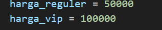

# Laporan Praktikum 2
## Program Pemesanan Tiket Bioskop

### Langkah 1
Pada langkah yang pertama buat kode dua variabel untuk mendefinisikan menyimpan harga tiket Reguler dan VIP dengan harga RP50.000 untuk Reguler dan RP100.000 untuk VIP:
