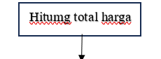
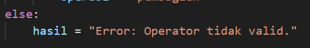

# Laporan Praktikum 2
## Program Pemesanan Tiket Bioskop

### Langkah 1
Pada langkah yang pertama buat kode dua variabel untuk mendefinisikan menyimpan harga tiket Reguler dan VIP dengan harga RP50.000 untuk Reguler dan RP100.000 untuk VIP:

### Langkah 2
Input tipe tiket sesuai yang diinginkan oleh user dan menanyakan kepada user memiliki kartu member atau tidak:

### Langkah 3
Setelah itu, program memvalidasi dan memeriksa tipe tiket yang dimasukkan user. apakah harga tiket sesuai dengan harga reguler atau harga vip. jika tipe tiket tidak valid maka program memberitahu ada kesalahan:

### Langkah 4
Menginisialisasi variabel diskon dengan nilai 0. hitung total harga dari keseluruhan harga yang sudah ditentukan sebelumnya:

### Langkah 5
Program ini menghitung diskon berdasarkan operator ternary, dimana jika user menjawab "Ya/Tidak" diskon 20%/0% diterapkan:

### Langkah 6
Program yang telah dimasukan pada langkah sebelumnya lalu dicetak total harga tiket baik reguleer atau vip yang harus dibayarkan oleh user:

### Hasil Eksekusi Program
Jika user memiliki kartu member:

Jika user tidak memiliki kartu member:

## Flowchart kasus 1

### Langkah 1
Memulai dengan terminator

### Langkah 2
Input tipe tiket yang akan digunakan yakni Reguler dan VIP, input status kepemilikan kartu member: kalau punya "Ya" atau tidak punya "Tidak":

### Langkah 3
Hitung harga tiket yang akan dipesan sesuai pilihan yakni Reguler dan VIP:

Untuk VIP:

Untuk Reguler:

### Langkah 4
Cek status kartu member user apakah memilikinya atau tidak:

Jika memiliki kartu member "Ya" maka diskon 20% akan diterapkan program dan apabila tidak memiliki kartu membar "Tidak" maka diskon tidak akan diterapkan:

### Langkah 5
Hitung semua total harga yang dipesan:

### Langkah 6
Output tampilan total harga akan keluar:

### Langkah 7
Selesai dengan terminator:

### Flowchart kasus 1

## Program Kalkulator Sederhana

### Langkah 1
Input dua angka yang ingin dihitung (angka bisa ditambahkan) misal angka 10 danangka 40 dan input operator (penjumlahan, pengurangan, perkalian, pembagian):

### langkah 2
Setelah memasukan angka yang ingin dihitung, kemudian masukan operator apa saja yang diinginkan misal pembagian. untuk pembagian angka 0 tidak akan menunjukkan hasil/error. Program ini menggunakan struktur kontrol if-elif-else untuk menentukan operasi yang akan dilakukan berdasarkan input operator:

Kalau operator yang dimasukkan tidak valid, maka program tidak bisa menyimpan pesan:

### Langkah 3
Setelah penghitungan angka, hasil akan ditampilkan. apabila menghasilkan string maka program mencetak hasil error perhitungan. sebaliknya jika menghasilkan angka, maka program dapat menjalankan operator dan angka yang digunakan:

### Hasil 

## Flowchart Kasus 2
### Langkah 1
